# Overview
This project demonstrate how to manage and devlop a python project using CI/CD with Azure Devops

## Instructions

### The architectural Diagram:
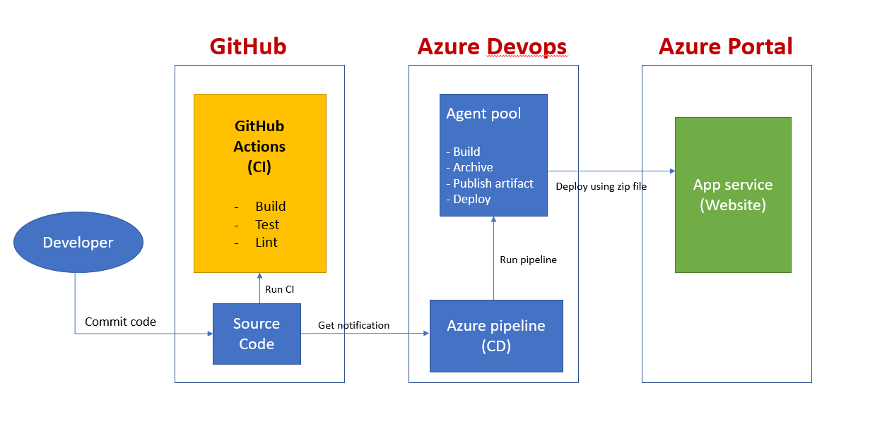

### Instructions for running the Python project
#### Project cloned into Azure Cloud Shell and test
Create a GubHub Repo (https://github.com/TylerLaTruong/flaskappudacity)

Add created ssh key to your GitHub: Go to Settings => SSH and GPG keys => New SSH Key

* Open Cloud shell using bash and clone project then go to project folder:

 git@github.com:TylerLaTruong/flaskappudacity.git

or

`$ git clone  git@github.com:TylerLaTruong/flaskappudacity.git`

`$ cd Azure-devops`

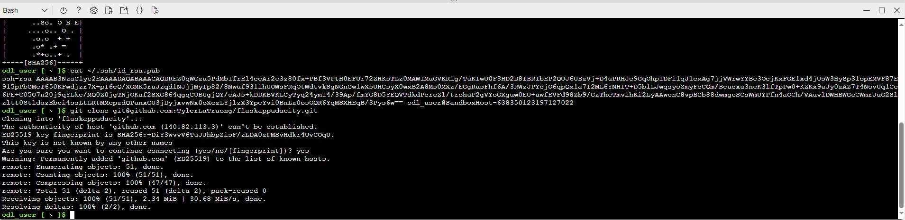

* Step testing 
python -m venv venv
source venv/bin/activate
Run make all to install dependency, test and lint your code using command: make all

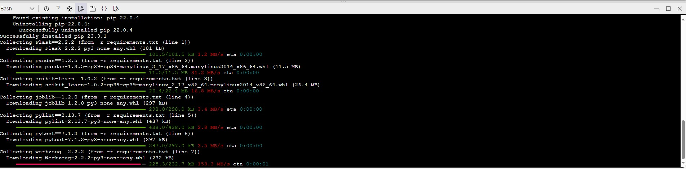

* Testing result:
After above step you see dependencies are installed, lint rate 10/10 and tests are passed as below:
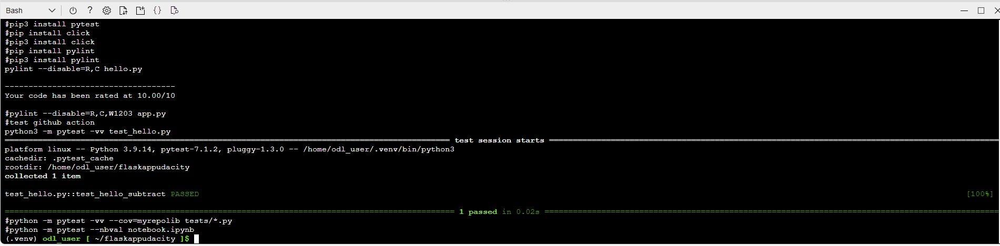
#### Project running on Azure App Service
Go to your Github Account and enable Github Actions
Replace .yml file with your code to make CI when any push actions perform
Push the changes to GitHub and verify that both lint and test steps pass in your project
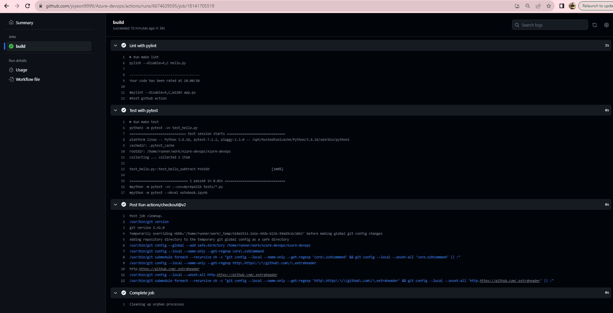

CD Azure:
Run your app using command: python app.py

* You can deploy this project direct to azure using command:
az webapp up --name flaskapptruonglv9 --resource-group Azuredevops --sku B1 --logs --runtime PYTHON:3.9 

And see the result deploy successfully:
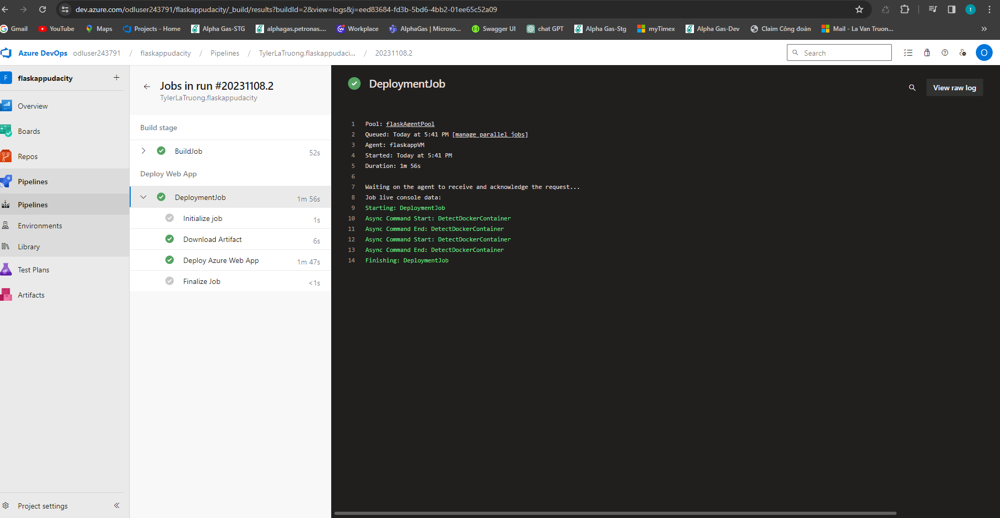

Can go to the url and check as well:
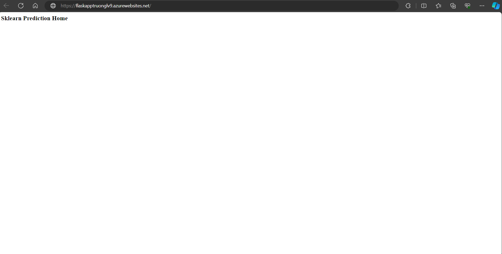

Note: The app service was created before.

* Running Azure App Service from Azure Pipelines automatic deployment
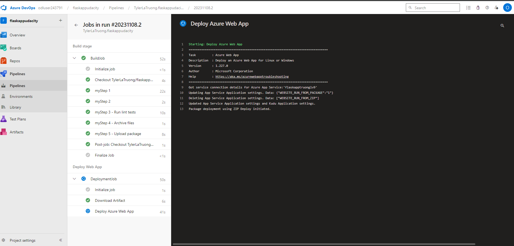

* Successful prediction from deployed flask app in Azure Cloud Shell.  [Use this file as a template for the deployed prediction](https://github.com/udacity/nd082-Azure-Cloud-DevOps-Starter-Code/blob/master/C2-AgileDevelopmentwithAzure/project/starter_files/flask-sklearn/make_predict_azure_app.sh).
The output should look similar to this:


Run prediction against a working devloyed Azure Application using command: 
```bash
$ chmod +xr make_predict_azure_app.sh ./make_predict_azure_app.sh
```
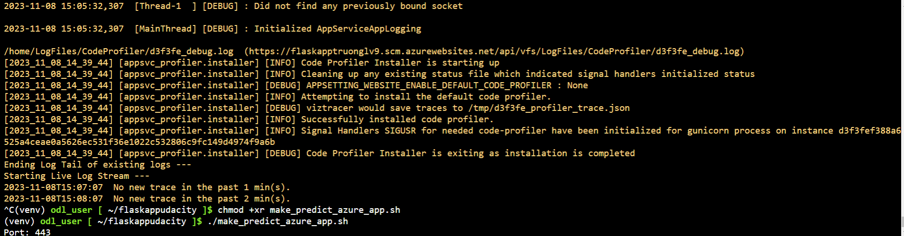

* Output of streamed log files from deployed application

az webapp log tail -g Azuredevops --name flaskapptruonglv9

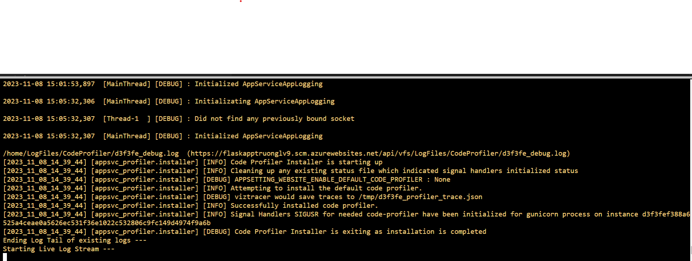

## Enhancements

If you want create resource fast(VM, Network, Disk...) you can:
Create an Agent (VM): Using Azure UI to create a default VM quickly
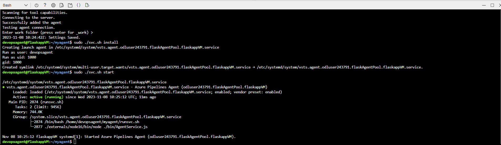

* Using terraform file
* Create template then can create environment pipelines with ease
Run pipeline successfully
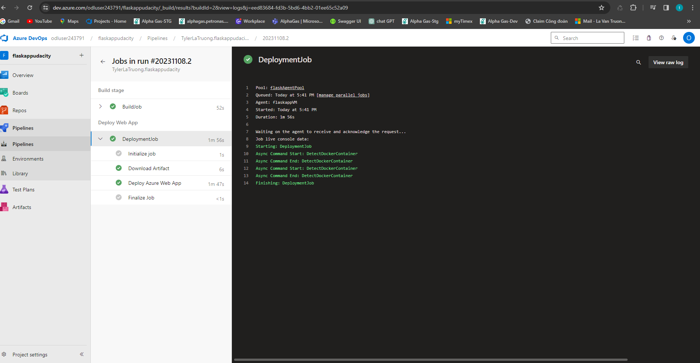

So that each environment we have a set of resources and its own pipeline. Developer just merge the code to target branch, pipieline will auto run
## Demo

Youtube link [Video introduction project](https://www.youtube.com/watch?v=kXto6AIGHbQ)
